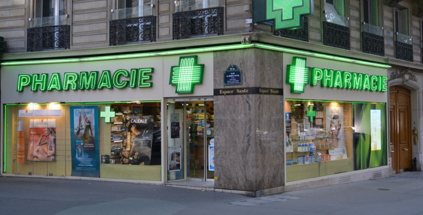

# Pharmacie_Sautheuz

    

------------------------------------------------------------------------------------------------------------
# PROJET

Projet scolaire à faire en binôme.

__Contexte :__

Il s'agit en fait d'une pharmacie, la pharmacie SAUTEUHZ à Givors, près de Lyon. Nouvellement établie
dans la région, le propriétaire de cette SPFPL souhaite une application web permettant aux personnels de la pharmacie de gérer les clients ayant des traitements réguliers, nécessitant un suivi particulier ainsi que les stock pour l'ensemble des médicaments.

------------------------------------------------------------------------------------------------------------
s

# ORGANISATION

__Maquettes et diagrammes du projet :__

+ <a href="https://www.figma.com/file/nAQHtUt5CkzNIyLk6PREF8/diagrame-utilisation-pharmacie?node-id=0%3A1&t=zEkO0qDOsu9EMiqR-1">Maquette et diagrammes sur Figma<a>

 

__Motif d'architecture logicielle :__
+ Architecture Modèle/Vue/Contrôleur (MVC)

 

<u>Nous avons utilisé les technologies suivantes:</u>

__Front-End :__
+ Le framework Bootstrap 5
+ Le framework Chartjs

__Back-End :__
+ Le framework NodeJS
+ Le framework ExpressJS

__Gestion BDD :__
+ SQL sous PHPMyAdmin

------------------------------------------------------------------------------------------------------------

Ce projet est réalisé par : [Maceo GONDRE](https://github.com/Maceoggit) et [Rhizlène ALFARDOUS](https://github.com/Rhizlene)

